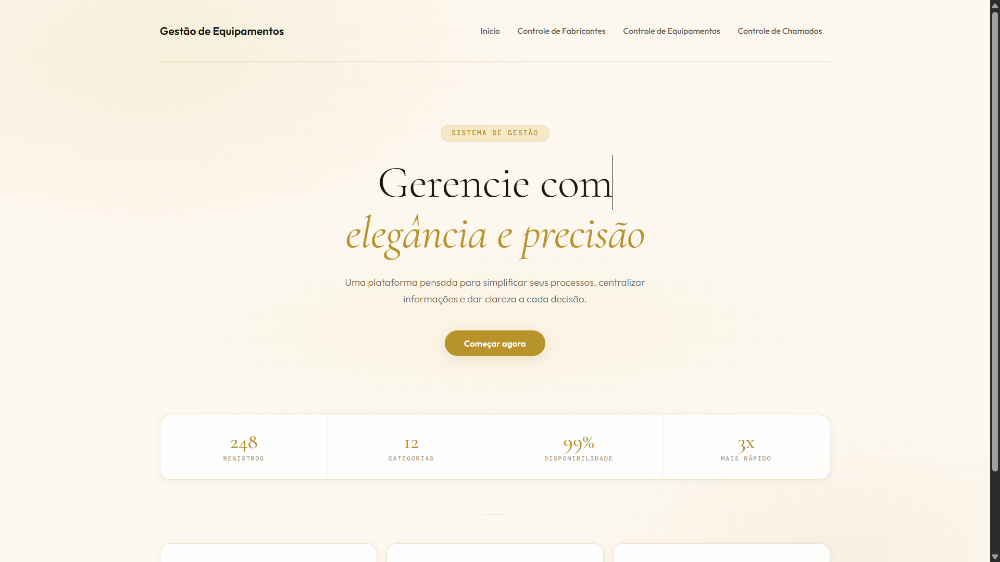
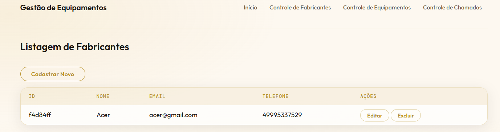
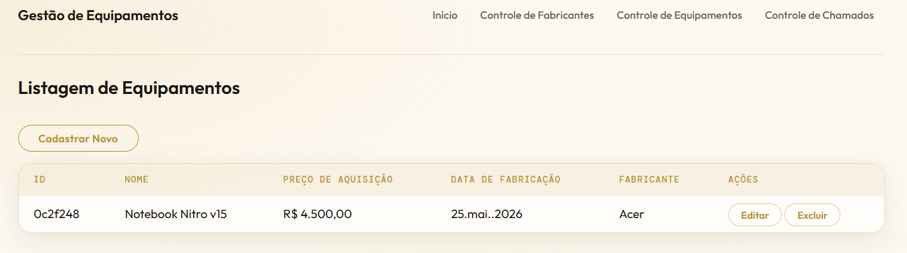
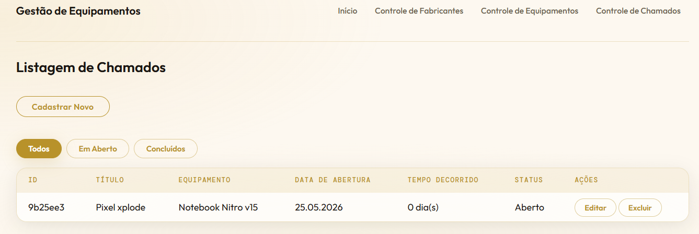

<div align="center">

**Gerencie com elegância e precisão.**

*Uma plataforma web pensada para simplificar processos, centralizar informações e dar clareza a cada decisão.*

<br/>

[](https://dotnet.microsoft.com/)
[](https://learn.microsoft.com/aspnet/core)
[](https://learn.microsoft.com/ef/core)
[](https://www.academiadoprogramador.net)

<br/>



</div>

---

## A História

**Pedro Henrique** gerenciava o inventário de equipamentos da empresa onde trabalha — fabricantes, máquinas, histórico de manutenções — tudo em planilhas do Excel. Funcional, mas lento e suscetível a erros.

Com o apoio da [Academia do Programador](https://www.academiadoprogramador.net), ele desenvolveu este sistema: uma aplicação web que **centraliza, organiza e agiliza** toda a gestão em um único lugar, com uma interface refinada e intuitiva.

---

## Funcionalidades

### 🏭 Controle de Fabricantes
- Cadastro com **nome, e-mail e telefone**
- Listagem com quantidade de equipamentos vinculados
- Edição e exclusão de registros



### ⚙️ Controle de Equipamentos
- Cadastro com **nome** *(mín. 6 caracteres)*, **preço de aquisição**, **fabricante** e **data de fabricação**
- Visualização completa do inventário com ID
- Edição e exclusão de registros



### 📞 Controle de Chamados
- Abertura de chamados vinculados a equipamentos, com **título**, **descrição** e **data de abertura**
- Listagem com **contador automático de dias em aberto**
- Filtro por status: `Todos` · `Em Aberto` · `Concluídos`
- Edição e exclusão de registros



---

## Tecnologias

```
┌─────────────────────────────────────────────┐
│  Linguagem     →   C# / .NET 10.0           │
│  Framework     →   ASP.NET Core (MVC)       │
│  ORM           →   Entity Framework Core    │
│  Testes        →   xUnit / MSTest           │
└─────────────────────────────────────────────┘
```

---

## Como Executar

**Pré-requisito:** [.NET 10.0 SDK](https://dotnet.microsoft.com/download/dotnet/10.0)

```bash
# 1. Clone o repositório
git clone https://github.com/seu-usuario/gestao-de-equipamentos-web.git
cd gestao-de-equipamentos-web

# 2. Restaure as dependências
dotnet restore

# 3. Execute a aplicação
dotnet run --project GestaoDeEquipamentosWeb.WebApp
```

Acesse em: `http://localhost:5000`

---

## Estrutura do Projeto

```
GestaoDeEquipamentosWeb/
│
├── 📁 GestaoDeEquipamentosWeb.WebApp/       ← Aplicação web (Controllers, Views)
├── 📁 GestaoDeEquipamentosWeb.Dominio/      ← Entidades e regras de negócio
├── 📁 GestaoDeEquipamentosWeb.Infra/        ← Repositórios e acesso a dados
└── 📁 GestaoDeEquipamentosWeb.Testes/       ← Testes automatizados
```

---

## Requisitos do Sistema

### Fabricantes
| # | Requisito | Detalhe |
|---|---|---|
| RF-01 | Cadastro | Nome, e-mail e telefone obrigatórios |
| RF-02 | Listagem | Exibe todos os fabricantes e equipamentos vinculados |
| RF-03 | Edição / Exclusão | Todos os campos são editáveis |

### Equipamentos
| # | Requisito | Detalhe |
|---|---|---|
| RF-04 | Cadastro | Nome *(mín. 6 chars)*, preço, fabricante, data de fabricação |
| RF-05 | Listagem | Exibe ID, nome, preço, data, fabricante |
| RF-06 | Edição / Exclusão | Todos os campos são editáveis |

### Chamados
| # | Requisito | Detalhe |
|---|---|---|
| RF-07 | Cadastro | Título, descrição, equipamento, data de abertura |
| RF-08 | Listagem | Exibe título, equipamento, data e **dias em aberto** |
| RF-09 | Edição / Exclusão | Todos os campos são editáveis |

---

## Licença

Projeto desenvolvido para fins educacionais no contexto do curso **Fullstack 2026** da [Academia do Programador](https://www.academiadoprogramador.net).

---

<div align="center">
  <sub>Feito com dedicação por Pedro Henrique dos Santos · Academia do Programador · 2026</sub>
</div>
